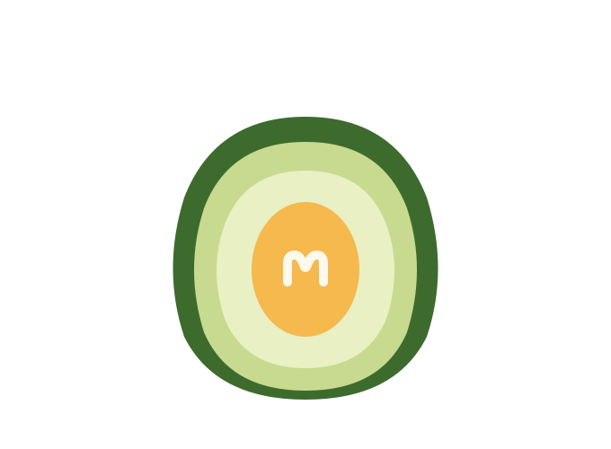

  
  
  # Mealdoo
  
  A web application for household grocery management and meal planning.

---

## 🥑 Overview

Mealdoo helps households track pantry inventory, plan meals, and optimize grocery shopping around local supermarket specials. It combines computer vision for receipt and product recognition with LLM-based meal planning.

## 🍳 Planned Features

- 🧾 **Receipt scanning**: Extract items and expiry dates automatically via OCR
- 📸 **Product recognition**: Identify pantry items from photos using vision models
- 📖 **Recipe management**: Store recipes with ingredient requirements and cooking time
- 🛒 **Shopping recommendations**: Suggest purchases based on inventory, usage patterns, and current Australian supermarket specials
- 📅 **Meal planning**: Generate multi-day meal plans from pantry stock, shopping list, saved recipes, and household size

## 🛠️ Tech Stack (planned)

- **Frontend**: Next.js 14 (App Router), TypeScript, Tailwind CSS
- **Backend**: FastAPI (Python)
- **Database**: PostgreSQL with pgvector
- **AI**: Cloud Vision API (OCR), CLIP embeddings (product recognition), LLM APIs (meal planning)
- **Deployment**: DigitalOcean

## 🚧 Status

Early design phase. Database schema and architecture in `/docs`.

## 📚 Documentation

- [Database design](./docs/database-design.md)

## 📄 License

MIT